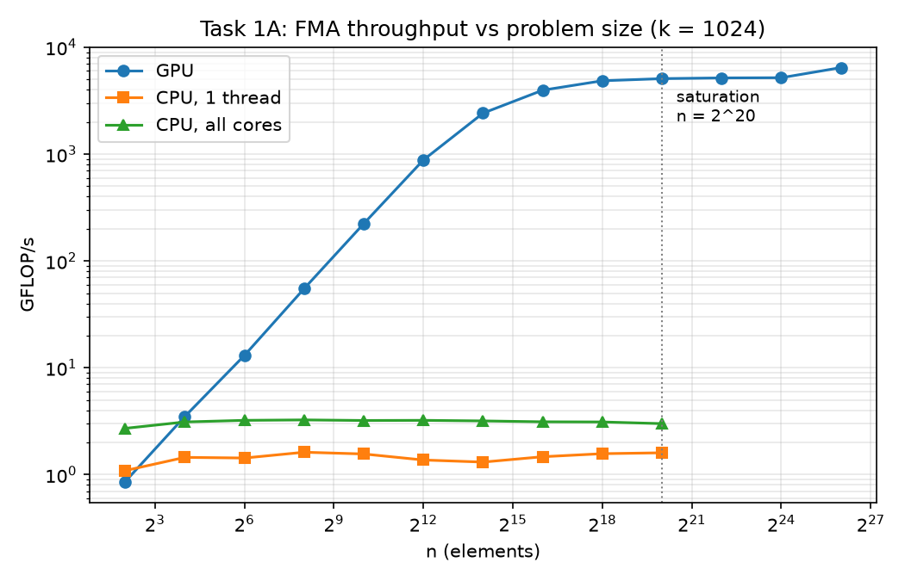
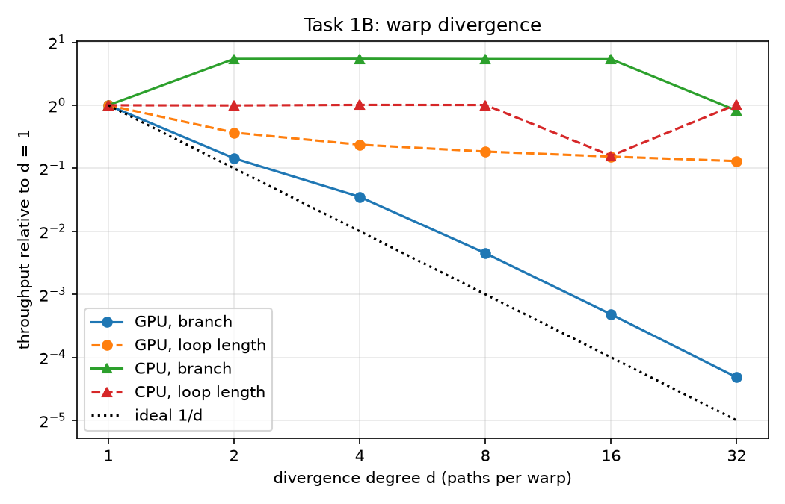
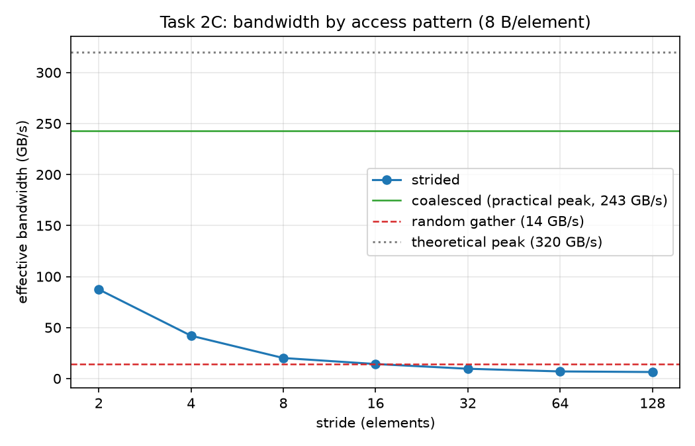
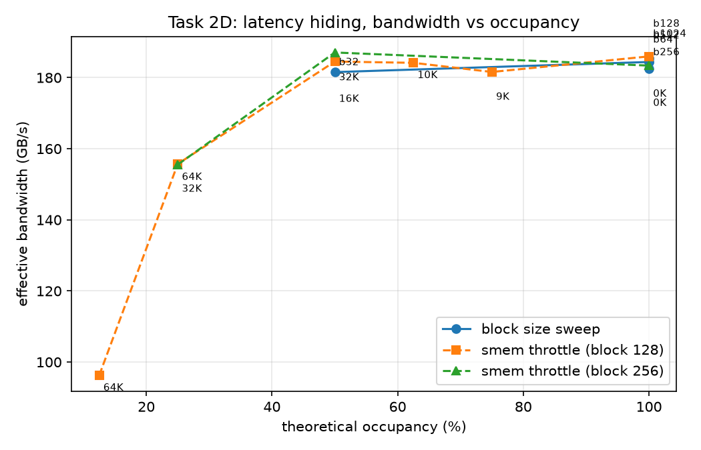

# Results report: exercise sheet 2 (SIMT, divergence, memory bandwidth)

All numbers in this report come from the committed CSVs in `results/`
(the summary block printed by `scripts/plot.py` reproduces them).

## 1. Setup

- **GPU:** Tesla T4 (Google Colab), compute capability 7.5, 40 SMs,
  max. 1024 threads/SM, theoretical peak bandwidth 320.1 GB/s
  (`2 * memory clock * bus width` = 2 x 5001 MHz x 32 B, queried at runtime).
- **Toolkit/driver:** CUDA 12.8, driver 13.0 (provenance line of the CSVs).
- **CPU reference:** Colab host VM, 2 threads (OpenMP `omp_max_threads=2`).
- **Methodology:** per configuration 3 warmup runs, then 10 timed runs,
  the median is reported. GPU times via `cudaEvent` pairs around the kernel
  only (no H2D/D2H in the timed window). No fast math, `-O3`, FLOP
  convention: 2 FLOP per FMA. All metrics come from `results/*.csv`.

## 2. Task 1: SIMT and warp divergence (compute-bound)

Kernel: one thread per element, read one `float`, run `k = 1024` FMA
iterations, write one `float`. Metric: GFLOP/s = `2 n k / t`.

### 2.1 Experiment A: scaling over n

- The sweep deliberately starts far below one warp (n = 4) so that both
  ends of the curve are visible. At the low end the GPU is **slower than
  the CPU**: at n = 4 it delivers 0.86 GFLOP/s against 1.09 (CPU, 1
  thread) and 2.71 (both cores). The cause is the fixed kernel-launch and
  timing overhead of ~9.5 µs per launch, which dwarfs the actual work.
  The GPU overtakes the best CPU value only from n ≈ 16 and leaves it
  behind for good from n ≈ 64.
- Full throughput comes much later still: from n ≈ 2^20 (1,048,576
  threads; with 40 SMs that is ~26,000 scheduled threads per SM, i.e. ~26
  full waves of the 40,960 threads that can be resident at once). Below
  that there are too few warps to hide instruction latency and to fill
  all SMs.
- GPU plateau: ~5,173 GFLOP/s. The largest point (n = 2^26) measured
  6,446 GFLOP/s; we attribute the jump to the T4 boost clock ramping up
  during the run (no clock control on Colab, see §4), and use the plateau
  as the honest throughput figure.
- CPU: ~1.6 GFLOP/s (1 thread) and ~3.2 GFLOP/s (both cores), essentially
  flat over n from the smallest size on: a CPU needs no mass parallelism
  to reach its (much lower) peak.
- Ratio GPU to CPU (both cores) at the plateau: ~1,600x. Two caveats: the
  Colab VM has only 2 CPU cores, and the workload is a serially dependent
  FMA chain behind a `noinline` call, so the CPU runs scalar code far
  below its own vectorized FP32 peak. The ratio compares this specific
  workload, not architecture peaks.

### 2.2 Experiment B: controlled warp divergence

Divergence degree d ∈ {1, 2, 4, 8, 16, 32}: branch on `threadIdx.x % d`,
one warp executes d distinct paths. Every path does exactly the same work
(k iterations, 1 FMA each), but the paths are operationally distinct (own
constants and instruction order, `__noinline__`) so the compiler cannot
merge them. Expectation under full serialization: slowdown ≈ d.

| d | GPU slowdown (branch) | ideal | CPU slowdown (branch) |
|---|---|---|---|
| 1 | 1.00 | 1 | 1.00 |
| 2 | 1.79 | 2 | 0.60 |
| 4 | 2.74 | 4 | 0.60 |
| 8 | 5.09 | 8 | 0.60 |
| 16 | 9.97 | 16 | 0.60 |
| 32 | 19.94 | 32 | 1.06 |

- GPU: the slowdown at d = 32 is 19.9x, i.e. more than an order of
  magnitude. The effect is real and not a compiler artifact (the spec's
  verification threshold of ~8x is met with margin).
- The slowdown sits at roughly 2/3 of the ideal d for d ≥ 4. This is
  consistent with the d = 1 baseline being latency-limited: each thread
  is one dependent FMA chain, so a single path cannot keep the FMA pipes
  full by itself. Divergent paths are independent instruction streams, and
  the Volta+ scheduler (independent thread scheduling) can interleave
  them, recovering part of the serialization cost. The paths still execute
  serially per cycle, hence the near-proportional growth.
- CPU (OpenMP, same `%d` branching): the absolute times show no trend in
  d (~170 ms for most d). The slowdown column is distorted because the
  d = 1 reference run itself was a noise outlier on the shared 2-core VM
  (284 ms, ~70% above typical); values below 1 mean "the reference was
  slow", not "divergence sped anything up". Flat within VM noise;
  measured, not just claimed.
- Secondary variant `looplen` (data-dependent trip count, normalized to
  equal total work): the slowdown saturates at 1.85x. Expected: the warp
  time is the maximum of the trip counts, and `max(k_i) ≈ 2k` independent
  of d, while total work stays constant.

**Why does the GPU serialize divergent paths?** A warp (32 threads) is the
execution unit of the SIMT model: before Volta there is a single program
counter per warp. On a branch that lanes take differently, the hardware
executes the paths one after another, masking the inactive lanes (active
mask). With d paths, a fraction of the lanes is active d times in
sequence, so execution time grows by roughly a factor of d. From Volta on
(independent thread scheduling) every thread has its own PC, but a warp
scheduler still issues one instruction per cycle for a group of convergent
lanes: divergent instruction streams remain serialized in time, only the
interleaving is more flexible, which is exactly the 2/3-of-ideal effect
measured above.

**Why is the same branch nearly free on a CPU?** Every core has its own
independent control flow; there is no lock-step group that must wait for
both paths. In addition, the pattern `i % d` is perfectly periodic and is
predicted essentially without misses by the branch predictor; speculative
out-of-order execution hides the remaining cost.

## 3. Task 2: memory access, latency hiding, bandwidth (memory-bound)

Streaming kernel `b[j] = a[j] * c`, n = 2^26 elements (256 MiB per array),
metric: effective bandwidth at 8 B/element (4 B read + 4 B write).

### 3.1 Experiment C: access patterns

- **Coalesced** (stride 1): 242.7 GB/s = 76% of the theoretical peak
  bandwidth (320.1 GB/s). This measurement serves as the practical peak
  (100%) that all percentages below refer to.
- **Strided:** falls steeply with growing stride: 87.4 GB/s (36%) at
  stride 2, 20.1 GB/s (8%) at stride 8, down to 6.4 GB/s (2.6%) at stride
  128. From stride ≈ 16 on it is at or below the random-gather level.
  Reason: instead of one contiguous 128-B transaction per warp, up to 32
  separate memory segments are touched; of every 32-B sector fetched from
  DRAM only 4 B are used.
- **Random gather:** 14.4 GB/s = 5.9% of the practical peak. Footnote on
  the byte convention: this is the payload bandwidth at 8 B/element; the
  4 B/element for reading the index array are physically on top (counting
  12 B/element the figure would be 21.6 GB/s).
- Validation: the checksums of all variants match the reference
  (relative error 0.0, see `results/run.log` of the measurement run).

### 3.2 Experiment D: latency hiding via occupancy

Grid-stride kernel (identical total work), number of resident warps varied
via (1) block size 32 to 1024 and (2) unused dynamic shared memory per
block as an occupancy throttle, run at block 256 and block 128 (the
smaller block reaches the 12.5% floor of 4 warps/SM that block 256 cannot
express). Occupancy is the theoretical value from
`cudaOccupancyMaxActiveBlocksPerMultiprocessor`.

- Shape as expected: bandwidth rises from 96 GB/s at 12.5% occupancy
  (4 warps/SM) through 156 GB/s at 25% to ~185 GB/s at 50%, and is flat
  from there on (182–187 GB/s at 50–100%, differences within run-to-run
  noise): from ~16 resident warps per SM the memory latency is fully
  hidden and DRAM bandwidth becomes the limit. At 12.5% the kernel
  reaches only about half the plateau; at 25% about 84%.
- Granularity note: with block 256 on the T4 (max. 32 warps/SM, 4 blocks
  of 8 warps) only the steps 25/50/100% materialize (the intended 75%
  step collapses into 50% because shared-memory allocation granularity
  rounds the 21.3 KiB throttle up); the block-128 series adds 12.5%,
  62.5% and 75%. The block-size series bottoms out at 50% (at block 32
  the 16-blocks/SM limit caps residency at 16 warps).
- The absolute level (~185 GB/s) is below the coalesced peak of experiment
  C (243 GB/s): the grid covers only the resident blocks, so each thread
  loops over many elements, which adds loop overhead and limits the number
  of independent loads in flight per thread.

**Interpretation:** the GPU hides memory latency by oversubscription with
warps: as long as enough warps are resident, the scheduler switches to a
runnable warp on every memory stall, hence the occupancy dependence. The
CPU hides latency with its cache hierarchy and hardware prefetching
instead: sequential accesses are fast, random accesses cause cache and TLB
misses. Consequence for data layout on GPUs: structure-of-arrays instead
of array-of-structures, arrange accesses so a warp generates contiguous
32/128-B transactions, avoid indirection/gather, align/pad data to
transaction boundaries.

## 4. Limitations

- **Theoretical instead of profiled occupancy:** Nsight Compute needs
  hardware counter permissions that the Colab runtime does not grant, so
  the automated run relies on the API value; `ncu` was not run.
- **A single GPU model** (Colab T4); no claim about other architectures,
  but all sizes and limits are queried at runtime.
- **No control over ECC and clock boost** on the cloud GPU, and no
  control over VM neighbors on the CPU side. The median of 10 launches
  damps outliers within a configuration, but not drift between
  configurations; visible as the 6,446 GFLOP/s outlier at n = 2^26 in
  experiment A, as ~10–20% level differences between whole runs, and as
  the slow CPU d = 1 reference in experiment B (284 ms vs. ~170 ms
  typical), which distorts the CPU slowdown column (see §2.2).
- **Weak CPU reference:** 2 cores only on the Colab VM, and the workload
  (dependent scalar FMA chain behind `noinline`) prevents vectorization,
  so the CPU numbers are far below the host CPU's peak; see the caveat in
  §2.1.
- CPU sweeps use smaller n than the GPU sweeps (runtime budget); since CPU
  throughput is flat over n, this does not distort the comparison.
