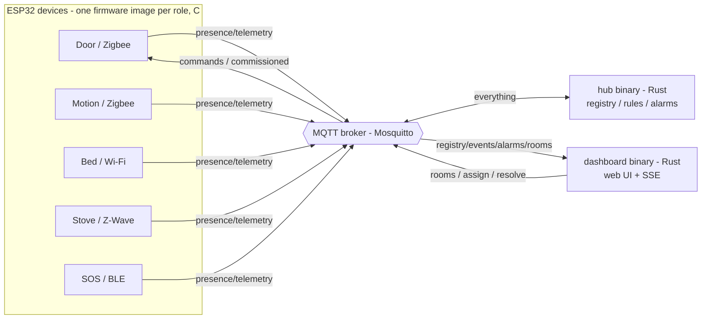

# Assisted Living Smart Home

A prototype smart-home demonstrator for an assisted-living / care setting. It
uses a **centralized, edge-based** model on top of **MQTT (Eclipse Mosquitto)**:
every device talks only to a single **hub** through the broker; the hub owns the
device registry, rooms, the rule engine and the alarms.

Stack (no Docker required on devices, self-contained binaries on the gateway):

- **Devices** - ESP32 firmware in **C** (ESP-IDF). One image per role; behaves
  like a real product (factory serial, pairing, telemetry, last-will).
- **Hub + Dashboard** - **Rust**, two static binaries (`hub`, `dashboard`). Copy
  and run; cross-compiles to a Raspberry Pi. No runtime, no container.
- **Broker** - **Mosquitto**, run natively (or via the optional compose file).

> See [`RESULT_OVERVIEW.md`](RESULT_OVERVIEW.md) for how the build maps onto the
> required smart-home architecture concepts, and [`CODE_GUIDE.md`](CODE_GUIDE.md)
> for a walk-through of the code.

## Architecture



All components are independent processes that know each other only through MQTT
topics and JSON. If one fails, the others keep running; retained messages plus
on-disk files (hub) and NVS (devices) let them re-sync on restart.

### Topic schema (`hub/crates/shared/src/topics.rs`)

| Topic | Content | Property |
|---|---|---|
| `smarthome/registry/<id>` | hub's device descriptor + online/offline | retained |
| `smarthome/devices/<id>/presence` | `online` / `offline` | retained, last-will |
| `smarthome/devices/<id>/telemetry` | state + battery + signal | - |
| `smarthome/devices/<id>/command` | manual control of a device | - |
| `smarthome/pairing/<serial>` (+ `.../commissioned`) | onboarding ad / reply | retained ad |
| `smarthome/events/<id>` | situations detected by the hub | - |
| `smarthome/alarms/<id>` | alarm/warning objects | retained |
| `smarthome/rooms/<roomId>` | a registered room (the "QR" location id) | retained |
| `smarthome/hub/status` · `smarthome/control/*` | hub status / control to hub | status retained |

The JSON wire format is identical across Rust and C (camelCase fields, a `kind`
discriminator on device state), defined once in the Rust `shared` crate and
mirrored by the firmware serialisers in `firmware/main/sensors/`.

## Devices

| Type | Product (sim) | Transport | Power |
|---|---|---|---|
| Door / contact | Aqara DW-S100 | Zigbee | battery |
| Motion (PIR) | Philips Hue SML-002 | Zigbee | battery |
| Bed occupancy | Emfit QS-Care | Wi-Fi | mains |
| Stove guard | Inirv Guard-Z | Z-Wave | mains |
| SOS pendant | CareTech SOS-Pendant | BLE | battery |

The radio standard is metadata; each device reports battery % and RSSI and
behaves realistically (battery drains, stove cools down, etc.).

## Prerequisites

- Rust (stable) for the hub/dashboard. Mosquitto for the broker.
- ESP-IDF v5.x + an ESP32 board for the devices (or just run the host test).

## Quick start

```bash
# 1) broker (native)
mosquitto -c mosquitto/mosquitto.conf
#    (or: docker compose up -d   -- optional convenience)

# 2) hub + dashboard
cd hub && cargo build --release
MQTT_URL=mqtt://localhost:1883 DATA_DIR=../data ./target/release/hub &
MQTT_URL=mqtt://localhost:1883 WEB_PORT=3000 ./target/release/dashboard &
./target/release/ctl seed-rooms     # optional: create some rooms

# 3) a device (real ESP32)
cd ../firmware
. $IDF_PATH/export.sh
idf.py set-target esp32
idf.py menuconfig      # Wi-Fi SSID/pass, MQTT broker URI = mqtt://<hub-ip>:1883, device role
idf.py build flash monitor
```

Open the operator console at <http://localhost:3000>. A fresh device shows up
under "Devices waiting to pair"; commission it into a room and it goes live.

## Onboarding (pairing / commissioning)

A factory-fresh device boots **unprovisioned**: it has only a serial + setup PIN
and enters **pairing mode** (a retained ad on `smarthome/pairing/<serial>`, with
a last-will that clears the ad if it gives up). From the dashboard you
**commission** it: the hub mints the operational id, assigns a room, replies, and
clears the ad. The device stores its identity in NVS and reboots into normal
operation. This mirrors Zigbee/Z-Wave inclusion and Matter setup codes.

## Detected situations (hub rules)

| Rule | Severity |
|---|---|
| `sos_pressed` - panic button pressed | critical - latches until resolved |
| `stove_on_no_motion` - stove left on, no motion in room | critical |
| `bed_left_at_night_no_return` - bed left at night, no return | critical |
| `door_open_no_motion` - door open, then no motion | warning |
| `device_offline` - registered device unreachable (auto-resolves) | warning |

Thresholds are short for demos and env-configurable (see `hub/README.md`). The
SOS alarm latches: releasing the button does not clear it; a caregiver must click
**Resolve**.

## Tests

```bash
cd firmware/host-test && ./build.sh   # gcc test of the portable device core
cd hub && cargo test                  # (if/when unit tests are added)
```

## Reset

```bash
cd hub && ./target/release/ctl clear   # clear retained state + data/*.json
```

## Project structure

```
hub/         Rust workspace: shared contracts, hub, dashboard, ctl
firmware/    ESP-IDF C firmware (one image per device role) + host test
mosquitto/   broker configuration
data/        persisted devices.json + rooms.json (created at runtime)
slides/      the project presentation (LaTeX Beamer)
docker-compose.yml   optional: run the broker in a container
```
