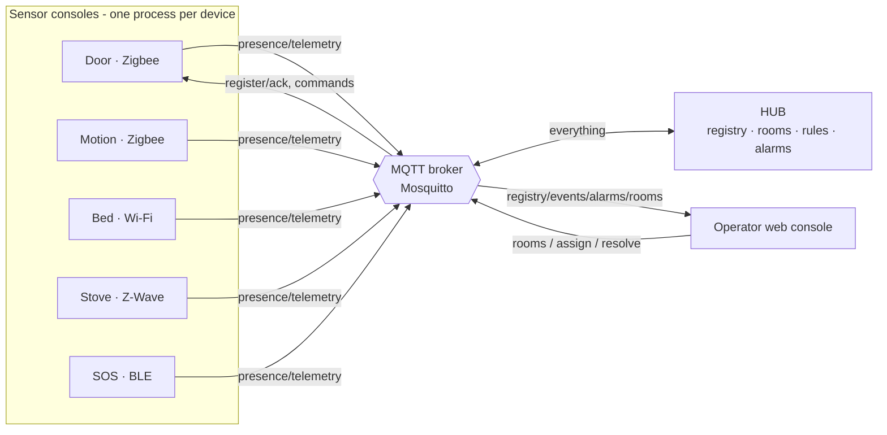

# Assisted Living Smart Home Demo

A prototype smart-home demonstrator for an assisted-living / care-home setting.
It uses **Docker + Eclipse Mosquitto + MQTT** and a **centralized** model: every
simulated device communicates with a single **Hub** through the broker. The hub
owns the device registry, the rooms, the rule engine and the alarms.

The headline feature: you "install" and operate each device from its **own
interactive console**. Run `pnpm run sensor`, register a new device or take over
an existing offline one, and that terminal *becomes* that device — close it and
the device goes offline.

> See [`RESULT_OVERVIEW.md`](RESULT_OVERVIEW.md) for how the build maps onto a
> reference smart-home architecture and the main requirements.

## Architecture



All components are standalone processes that know each other only through MQTT
topics. If one fails, the others keep running; retained messages + on-disk files
let them re-sync on restart.

### Topic schema (`src/shared/topics.ts`)

| Topic | Content | Property |
|---|---|---|
| `smarthome/registry/<id>` | hub's device descriptor + online/offline status | retained |
| `smarthome/devices/<id>/presence` | `online` / `offline` | retained, last-will |
| `smarthome/devices/<id>/telemetry` | state + battery + signal | - |
| `smarthome/devices/<id>/command` | manual control of a device | - |
| `smarthome/hub/register` · `…/register-ack/<reqId>` | onboarding request / reply | - |
| `smarthome/events/<id>` | situations detected by the hub | - |
| `smarthome/alarms/<id>` | alarm/warning objects | retained |
| `smarthome/rooms/<roomId>` | a registered room (the "QR" location id) | retained |
| `smarthome/control/{alarms,rooms,devices}` | control messages → hub | - |

## Devices

Each type carries a realistic spec sheet (`src/sensors/device-catalog.ts`) and
reports battery % and signal strength (RSSI):

| Type | Product (sim) | Transport | Power |
|---|---|---|---|
| Door / contact | Aqara DW-S100 | Zigbee | battery |
| Motion (PIR) | Philips Hue SML-002 | Zigbee | battery |
| Bed occupancy | Emfit QS-Care | Wi-Fi | mains |
| Stove guard | Inirv Guard-Z | Z-Wave | mains |
| SOS pendant | CareTech SOS-Pendant | BLE | battery |

## Prerequisites

- Node.js >= 18, pnpm
- Docker + Docker Compose (for the Mosquitto broker)

## Quick start

```bash
pnpm install
pnpm run up      # 1) start Mosquitto (Docker)
pnpm run hub     # 2) start the central hub          (own terminal)
pnpm run web     # 3) operator console -> :3000        (own terminal)

pnpm run seed    # 4) optional: create rooms + a fleet of OFFLINE devices
pnpm run wake    # 5) open one console window per offline device
```

`pnpm run start` runs the hub + web together. Open the operator console at
<http://localhost:3000>.

## Installing / operating a device

```bash
pnpm run sensor                       # interactive: pair a NEW device OR take over an offline one
pnpm run sensor -- --id bed-abc       # take over a specific existing device
pnpm run sensor -- --type stove       # quick-provision a new stove (auto id, no pairing)
pnpm run sensor -- --type door --room Kitchen   # quick-provision into a room
```

### Onboarding a new device (pairing / inclusion)

Like a real product, a brand-new device boots **unprovisioned** and enters
**pairing mode**: it advertises a factory identity (serial + setup PIN) and waits
to be commissioned. `pnpm run sensor` → *register a new device* → choose a type,
then either:

- **commission here** — pick a room right in the console (it acts as the app), or
- **wait for the app** — the device shows up in the operator console under
  **"Devices waiting to pair"**; click **Add**, give it a name and a room.

Only then does the hub mint the operational device id and the console becomes the
live device. Quitting before commissioning clears the pairing ad automatically.

Inside a device console:

| Key | Action |
|---|---|
| `space` | toggle the device's primary state (switches to manual) |
| `m` | switch auto ↔ manual |
| `o` | simulate the network link dropping (offline) |
| `q` / `Ctrl+C` | go offline and quit |

Closing the window (or the process dying) publishes the MQTT **last-will**, so the
hub marks the device offline within seconds — and `pnpm run wake` brings every
offline device back, each in its own window.

## Rooms & assignment (the "QR scan")

Create rooms in the operator console. Each room has a code (the content of its
QR). Assign a device to a room in three ways: the per-device **dropdown**, by
**typing/pasting the room code** ("scan the QR"), or while pairing it. The hub
stores the location in the registry and the live device console reflects it
immediately.

## Time & day/night

The hub uses the **real system clock**; the operator console shows a **live
clock** and a **Day / Night** badge. The night-based rule (`bed_left_at_night…`)
follows the clock's night window (default 22:00–07:00, env `NIGHT_START`/`NIGHT_END`).
For demos, the **🌙 Simulate night** button in the header forces the hub to treat
the time as night at runtime (and back).

## Detected situations (hub rules)

| Rule | Severity |
|---|---|
| `sos_pressed` — panic button pressed | critical — **latches until resolved** |
| `stove_on_no_motion` — stove left on, no motion in room | critical |
| `bed_left_at_night_no_return` — bed left at night, no return | critical |
| `door_open_no_motion` — door open, then no motion | warning |
| `device_offline` — registered device unreachable (auto-resolves) | warning |

The SOS alarm models a panic button: releasing it does **not** clear it — a
caregiver must click **Resolve**. Other thresholds are deliberately short for the
demo and are env-configurable (`STOVE_ON_SECONDS`, `BED_ABSENCE_SECONDS`,
`FORCE_NIGHT`, …).

## Tests

```bash
pnpm run typecheck   # TypeScript type checking
pnpm run smoke       # end-to-end test with an embedded broker (no Docker)
```

The smoke test starts an embedded MQTT broker, loads the hub in-process, onboards
a stove and verifies the full chain: onboarding → rule alarm → offline fault →
auto-resolve.

## Resetting

```bash
pnpm run clear-devices   # clear retained broker state + wipe data/*.json (stop the hub first)
```

## Project structure

```
src/
  shared/      topics, data types, MQTT helpers (shared contracts)
  sensors/     base sensor + door/motion/bed/stove/sos, device catalog,
               interactive console, hub-client, factory, run.ts launcher
  hub/         central hub: registry, rules, alarms, config, index.ts
  web/         operator console (Express + SSE) and static UI
scripts/
  seed.ts          create rooms + a fleet of offline devices
  wake-offline.ts  open a console window per offline device
  clear-devices.ts reset broker + persisted state
  smoke-test.ts    end-to-end test without external dependencies
mosquitto/     broker configuration
data/          persisted devices.json + rooms.json (created at runtime)
docker-compose.yml
RESULT_OVERVIEW.md   results write-up + architecture mapping
```
